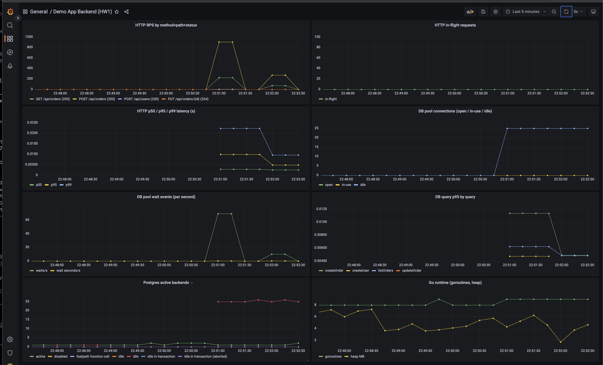
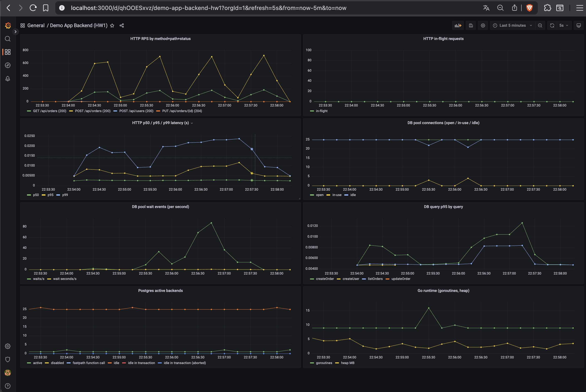
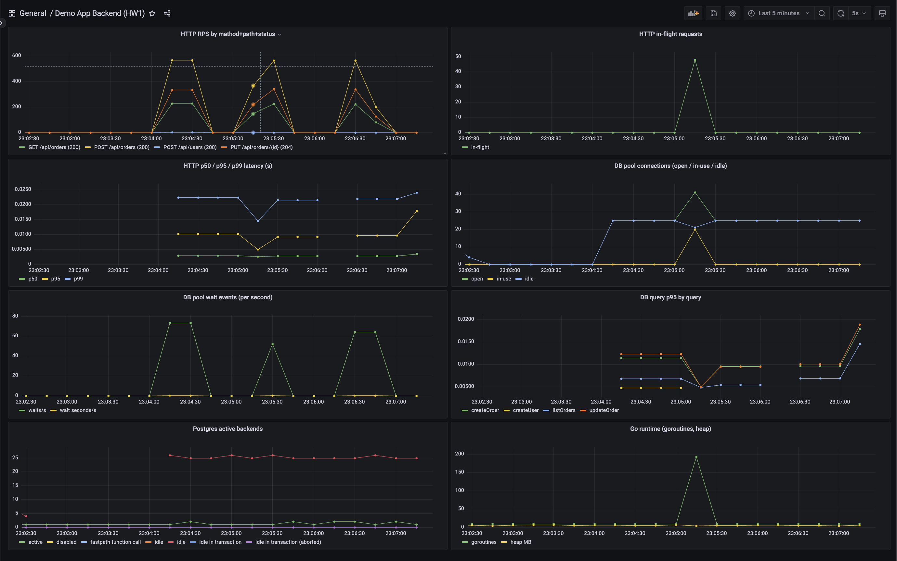
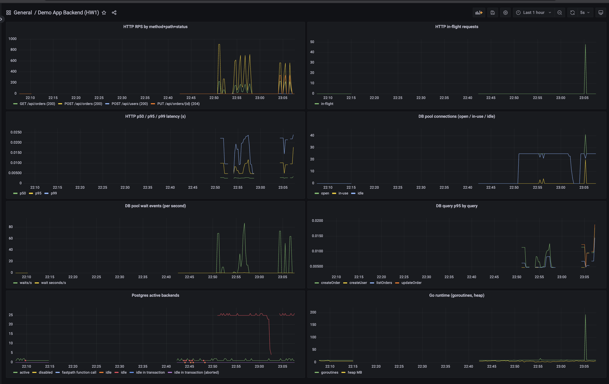

# HW_1. Нагрузочное тестирование demo-app-1

Стек: Go (mux) + Postgres 15 + Nginx + Prometheus / Grafana + k6 (remote write). Подъём: `docker compose up -d --build`.

## 1. Метрики

Было в `backend/main.go`:

- `http_request_duration_seconds` (histogram: method, path, status)
- `http_requests_total` (counter)
- `db_query_duration_seconds` (histogram без лейблов)

Проблемы: `path` сырой (кардинальный взрыв на `/api/users/123`), `db_query_duration_seconds` без разделения по запросу, нет in-flight, нет статистики пула БД.

Добавил:

- `http_requests_in_flight` (gauge)
- `db_pool_open_connections`, `db_pool_in_use_connections`, `db_pool_idle_connections` (gauges из `sql.DB.Stats()`, тик 1 с)
- `db_pool_wait_count_total`, `db_pool_wait_seconds_total` (counters)
- Лейбл `query` на `db_query_duration_seconds`
- Нормализация `path` через `mux.CurrentRoute().GetPathTemplate()`
- `SetMaxOpenConns(50)`, `SetMaxIdleConns(25)`, `SetConnMaxLifetime(5m)`

## 2. Сценарии

`k6/scripts/`:

- `storm.js`: 0 → 1000 VU за 10 с, плато 30 с, спуск 30 с. Резкий пик.
- `wave.js`: 0 → 500 VU за 2 мин, плато 1 мин, спуск 1 мин. Точка перелома.
- `pulse.js`: три импульса по 35 с (600 VU) с окнами тишины 30 с, микс 50% POST + 30% PUT (горячий id 1-50) + 20% GET. Восстановление между бёрстами и row-lock contention на UPDATE.

Запуск (без автозапуска k6):

```bash
docker compose up -d db backend nginx prometheus grafana postgres_exporter node_exporter cadvisor
docker compose run --rm k6 run --out experimental-prometheus-rw /scripts/storm.js
```

## 3. Результаты

| Сценарий | Длительность | VU peak | Запросов | RPS | fail | p95 (все) | p95 (ок) |
|---|---|---|---|---|---|---|---|
| Шторм | 70 с | 1000 | 159 541 | 2 277 | 77.0% | 474 мс | 75 мс |
| Волна | 4 мин | 500 | 469 278 | 1 955 | 75.9% | 180 мс | 51 мс |
| Пульсация | 2 мин 45 с | 600 | 291 980 | 1 769 | 71.0% | 238 мс | 78 мс |

Backend под нагрузкой (peak):

| Метрика | Шторм | Волна | Пульсация |
|---|---|---|---|
| `http_requests_in_flight` | ~100 | ~25 | ~70 |
| `db_pool_in_use_connections` | ~25 | ~10 | 50 (cap) |
| `db_pool_wait_count` (за период) | 1 466 | 6 418 | 6 290 |
| `db_query_duration_seconds` p95 createOrder | 11 мс | 10 мс | 13.5 мс |
| `db_query_duration_seconds` p95 updateOrder | n/a | n/a | 13.8 мс |
| `db_query_duration_seconds` p95 listOrders | 8 мс | 8 мс | 7.5 мс |
| pg active backends | 11 | 11 | 11 |

### 3.1 Шторм



Острый пик RPS ~1000, in-flight ~100, разовый всплеск wait events ~80/с. Возврат к нулю за 1-2 минуты.

### 3.2 Волна



Треугольник: RPS, in-flight и wait events растут линейно, плато, спад. DB pool низкий, упёрлись не в БД.

### 3.3 Пульсация



Три одинаковых «зуба». DB pool in-use упирается в 50 (cap `MaxOpenConns`), в окнах тишины уходит к нулю. p95 `updateOrder` на ~0.3 мс выше `createOrder`, мягкое row-lock contention. Деградации между импульсами нет.

### 3.4 Все три на одной шкале



`Last 1 hour`. Слева спайк Шторма, по центру треугольник Волны, справа три столбика Пульсации.

## 4. Корневая причина 70% потерь

Лог nginx, 617 309 строк за прогон:

```
[crit] connect() to 172.18.0.6:8081 failed (99: Address not available)
       while connecting to upstream
```

`EADDRNOTAVAIL` означает, что у ядра кончились эфемерные порты на исходящих сокетах к backend.

В `nginx/default.conf` нет keepalive в апстриме. Каждый HTTP-запрос открывает новый TCP-коннект к `backend:8081`, после закрытия 60 секунд в TIME_WAIT.

При 28 000 эфемерных портов и TIME_WAIT 60 с:

```
28 000 / 60 ≈ 470 новых исходящих соединений в секунду
```

Совпадает с наблюдаемым потолком успешных RPS на backend.

Backend и БД не насыщены: p99 handler ≤25 мс, БД p95 8-14 мс, `pg_stat_activity active = 11`, `process_open_fds = 34`.

## 5. Решения

MUST:

1. **Keepalive в nginx → backend**:
   ```nginx
   upstream backend_app {
       server backend:8081;
       keepalive 64;
       keepalive_requests 10000;
       keepalive_timeout 60s;
   }
   location /api/ {
       proxy_pass http://backend_app/api/;
       proxy_http_version 1.1;
       proxy_set_header Connection "";
   }
   ```
   Прогноз: fail rate 0-5%, RPS уходит к нескольким тысячам.
2. **Пул БД по формуле** `MaxOpenConns ≈ RPS × средняя_длительность_DB_запроса`. На 1000 RPS × 10 мс = 10-30 одновременных, ставить 30-50. Параллельно поднять `max_connections` Postgres или поставить PgBouncer.

SHOULD:

3. HAProxy с 3 backend (`docker-compose-lb.yaml`), тоже с keepalive к апстримам.
4. Тюнинг ядра: `net.ipv4.ip_local_port_range = 1024 65535`, `net.ipv4.tcp_tw_reuse = 1`, `net.core.somaxconn = 4096`.
5. Rate limiting (`limit_req_zone`) и circuit breaker (`golang.org/x/sync/semaphore`).

COULD:

6. Redis-кэш на `GET /api/orders`.
7. Индексы на `created_at`, `auto_explain` + `pg_stat_statements` (уже включён).
