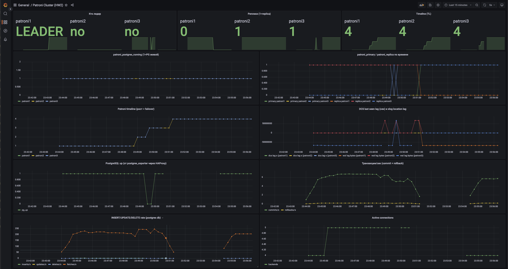
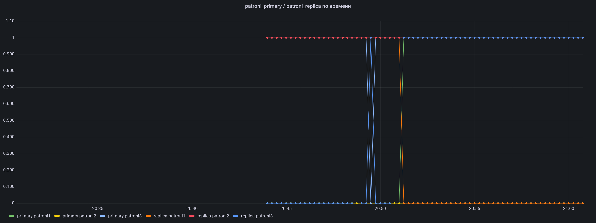
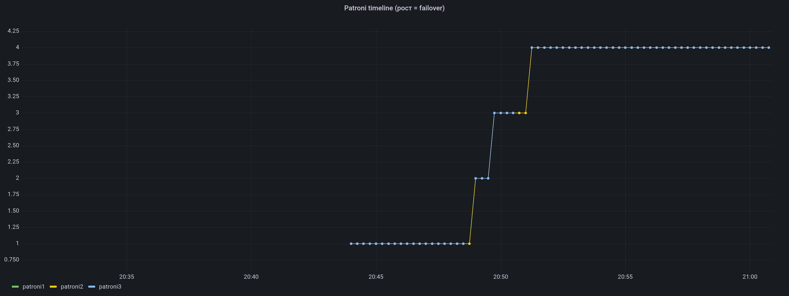
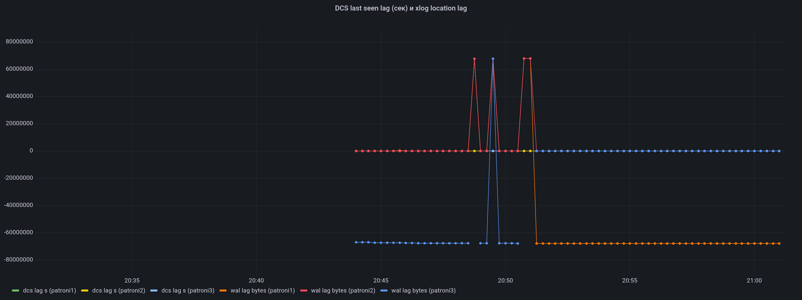
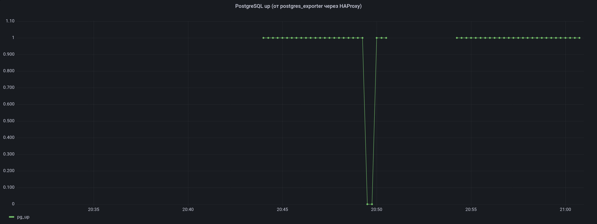
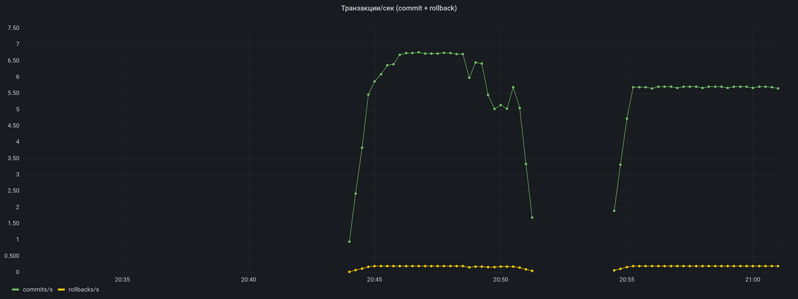
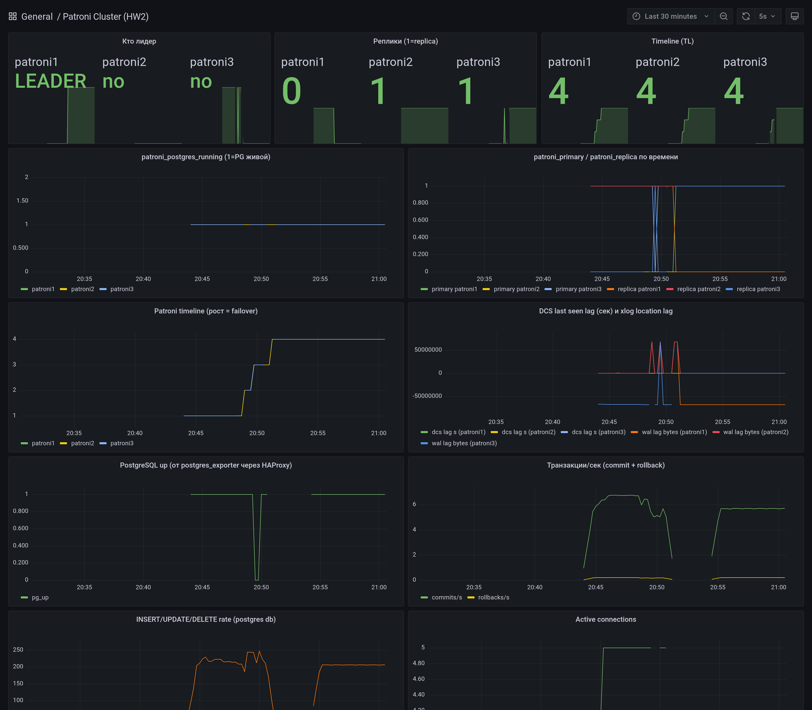

# HW2 практика. Patroni + etcd + HAProxy

## Что подняли

`docker compose up -d` из `postgres-ha/` поднимает:

| Сервис | Кол-во | Назначение |
|---|---|---|
| etcd | 3 | DCS (Distributed Configuration Store) на алгоритме Raft. Хранит leader key, состояние кластера, нужен кворум 2/3 |
| Patroni + PostgreSQL 17 | 3 | Каждый узел: PG-инстанс + Patroni-агент. Patroni борется за leader key в etcd, держит конфиг PG в актуальном состоянии |
| HAProxy | 1 | TCP-балансировщик. Слушает 5000 (primary) и 5001 (replicas), проверяет здоровье через REST API Patroni на 8008 |
| Prometheus | 1 | Сбор метрик |
| Grafana | 1 | Дашборды (Postgres Overview, PostgreSQL Database, PostgreSQL Patroni) |
| postgres_exporter | 1 | Метрики Postgres, читает через HAProxy:5000 (мастер) |

Сборка patroni-образа: `docker build -t patroni .` в `patroni-master/` (на arm64 confd компилируется из исходников, ~3 минуты).

## Дашборд Grafana

Готовые дашборды из `grafana_dashboards/` (Postgres Overview, PostgreSQL Database, PostgreSQL Patroni) большей частью пустые: их PromQL рассчитан на лейблы PMM (`service_name`, `node_name`, `release`, `environment`, `kubernetes_namespace`), а наши postgres_exporter и patroni выставляют другие (`job`, `name`, `scope`, `instance`). Дашборды открываются и валидируются по схеме, но в панелях `No data`.

Поэтому собрал отдельный дашборд **Patroni Cluster (HW2)** под реальные метрики (`patroni_primary`, `patroni_replica`, `patroni_postgres_timeline`, `patroni_postgres_running`, `patroni_dcs_last_seen`, `pg_up`, `pg_stat_database_*`). Скриншоты ниже сняты с него во время и после серии failover-экспериментов из соответствующего раздела отчёта.



*Окно `Last 15 minutes`. Сверху три stat-карточки: текущий лидер (patroni1), реплики (patroni2, patroni3), Timeline на всех узлах 4. Ниже видна история переключений: linia patroni_primary прыгает между узлами, всплески DCS-лагов в момент потери кворума etcd, провал pg_up в окне выключенного HAProxy.*

## Базовое состояние

`patronictl list`:

```
+ Cluster: demo (7646901598344130583) --------+----+-------------+-----+
| Member   | Host       | Role    | State     | TL | Receive LSN | Lag |
+----------+------------+---------+-----------+----+-------------+-----+
| patroni1 | 172.18.0.7 | Replica | streaming |  1 |   0/40A53D0 |   0 |
| patroni2 | 172.18.0.2 | Replica | streaming |  1 |   0/40A53D0 |   0 |
| patroni3 | 172.18.0.5 | Leader  | running   |  1 |             |     |
+----------+------------+---------+-----------+----+-------------+-----+
```

Объяснение:

- 3 узла, на TL (timeline) 1, лаг репликации 0.
- patroni3 держит leader key в etcd, на нём PG в режиме `running` (принимает запись).
- patroni1, patroni2 в режиме `streaming`: WAL льётся синхронно с лидера.

HAProxy stats доступен на `http://localhost:7001/`. Конфиг (`/etc/haproxy/haproxy.cfg` внутри `demo-haproxy`):

- listener `primary` на 5000: бэкенды это patroni1, patroni2, patroni3. Healthcheck `httpchk HEAD /primary` к порту 8008. Patroni отвечает 200 на `/primary` только на лидере, поэтому в этом пуле живой один сервер.
- listener `replicas` на 5001: то же самое, но `/replica`. Здесь живых два.
- Маппинг портов наружу (из `docker-compose.yml`): хост 5002 → контейнер 5000 (мастер), хост 5001 → контейнер 5001 (реплики), хост 7001 → контейнер 7000 (stats).

## SQL и traffic-generator

Через `psql` к `haproxy:5000` (мастер) накатил DDL из задания (`owners`, `events`, индексы, foreign key, seed данных).

`pip3 install psycopg2-binary` локально, запустил `python3 -u traffic-generator.py`. Скрипт коннектится на `localhost:5002` с `target_session_attrs=read-write`, делает INSERT каждую секунду, SELECT каждые 2 секунды.

Пишет на мастер, читает оттуда же (потому что 5002 это мастер-пул HAProxy в наружной нумерации). Чтобы читать с реплик, надо было бы указать порт 5001 хоста и убрать `target_session_attrs`.

## Failover-эксперименты

Все логи в `/tmp/postgres-ha-experiments.log`. Снимок состояния делался через `patronictl list` после каждого шага плюс хвост traffic-generator-а.

### 1. Падение лидера (`docker stop demo-patroni3`)

После 30 секунд:

```
| patroni1 | 172.18.0.7 | Leader  | running   |  4 |
| patroni2 | 172.18.0.2 | Replica | streaming |  4 |
```

- Patroni TTL leader key ~30 с. Пока он не истёк, новых выборов не происходит, HAProxy уже видит, что 8008 не отвечает у patroni3, и убирает его из бэкенда.
- После истечения TTL patroni1 и patroni2 видят, что leader key в etcd свободен, претендуют. Один выигрывает (patroni1), увеличивает TL до 4.
- В логе traffic-generator: connection lost в 23:50:31, серия reconnect-попыток до 23:50:44, дальше INSERT-ы возобновились. Окно простоя примерно 12-15 секунд.



*Момент failover около 20:50. До этого синяя линия (primary patroni3) держала 1, после неё primary становится patroni1 (зелёная). Replica-индикаторы патрони1 и 2 переключаются симметрично. Короткие провалы в середине это серия экспериментов с etcd-кворумом, когда Patroni сам себя демонизирует.*



*Каждая ступенька timeline это произошедший failover. На графике TL прошёл 1 → 2 → 3 → 4 в ходе экспериментов. Все узлы всегда на одной TL, потому что replica сразу же подхватывает новую timeline с лидера. Если бы какой-то узел отстал на TL, было бы видно расхождение, и Patroni сделал бы pg_rewind при возврате.*

### 2. Возврат старого лидера (`docker start demo-patroni3`)

```
| patroni1 | 172.18.0.7 | Leader  | running   |  4 |
| patroni2 | 172.18.0.2 | Replica | streaming |  4 |
| patroni3 | 172.18.0.5 | Replica | streaming |  4 |
```

patroni3 вернулся как реплика. Patroni сравнивает свой timeline с тем, что в etcd, видит что отстал, делает `pg_rewind` от текущего лидера и встаёт в streaming. TL не меняется.

### 3. Падение одной ноды etcd

```
| patroni1 | Leader (TL 4)
| patroni2 | Replica streaming
| patroni3 | Replica streaming
```

Кворум 2/3 жив. Кластер работает как ни в чём не бывало. traffic-generator продолжает писать без единого сбоя.

### 4. Падение второй ноды etcd (потеря кворума)

```
patronictl list возвращает:
etcd.EtcdConnectionFailed: No more machines in the cluster
patroni.dcs.etcd3.Etcd3Error: Etcd is not responding properly
```

Кворум 1/3, etcd не пишет. Patroni не может продлить TTL leader key и **демонизирует свой PG в read-only** (Patroni умолчательно делает demote, чтобы избежать split-brain).

В traffic-generator: `server closed the connection unexpectedly`. Записи не идут.



*Три красно-синих пика около 20:48-20:51 это моменты, когда у Patroni-нод обновлялась информация в DCS после потери и восстановления кворума. Когда кворума нет, `patroni_dcs_last_seen` перестаёт расти, и метрика `time() - patroni_dcs_last_seen` отображает накопленный лаг. Отрицательные постоянные значения wal lag это то, что новая реплика отстаёт от лидера на 68 МБ (разрыв timeline после failover, заполнится pg_rewind при подключении).*

### 5. Восстановление etcd

После `docker start demo-etcd1 demo-etcd2`:

```
| patroni1 | Leader running TL 4
```

Кворум вернулся, Patroni переизбрал лидера (TL не увеличился, потому что patroni1 успел стать лидером раньше после etcd-восстановления). traffic-generator продолжил.

### 6. Падение HAProxy

`patronictl list` показывает, что кластер здоров (все узлы работают, лидер пишет). Но traffic-generator не может подключиться:

```
[23:49:43] Connection failed: connection to server at "localhost"
(127.0.0.1), port 5002 failed: Connection refused
```

HAProxy это **SPOF** в текущей конфигурации. Кластер БД ОК, но точка входа одна.



*Provider линия `pg_up`. Резкий провал в 0 в районе 20:49 это окно, пока был остановлен HAProxy. postgres_exporter сам ходит через HAProxy к мастеру и не может построить соединение, отдаёт `pg_up=0`. То же видит traffic-generator. После старта HAProxy метрика возвращается к 1.*

### 7. Восстановление HAProxy

После `docker start demo-haproxy` traffic-generator переподключился за ~2 секунды, INSERT-ы пошли.



*Commits/s по `postgres` db. Видно, как traffic-generator выводит TPS на ~5-7 коммитов в секунду (1 INSERT в секунду от себя плюс служебные коммиты от Patroni и postgres_exporter), потом два провала: первый в 20:50 это потеря кворума etcd, второй и более глубокий в 20:52 это окно без HAProxy. Восстановление возвращает TPS на тот же уровень в течение секунд.*

## Сводка failover

| Сценарий | Кластер | Приложение | RTO (наблюдаемое) |
|---|---|---|---|
| Падение реплики | Работает, в etcd 1 узел потерян, но репликация по 1 живой реплике продолжается | Без последствий | 0 |
| Падение лидера | Через TTL (~30 с) проходят выборы, новый лидер | 12-15 с downtime | ~15 с |
| Падение 1 etcd (2/3 кворум) | Работает | Без последствий | 0 |
| Падение 2 etcd (1/3, нет кворума) | Лидер демонизируется, записи нет | Не пишет | До восстановления кворума |
| Падение HAProxy | Работает (cluster healthy) | Не может коннектиться | До восстановления HAProxy |

## SPOF и что с этим делать

| Точка | Проблема | Лечение в продакшене |
|---|---|---|
| HAProxy единственный | Падает HAProxy, лежит весь кластер для клиентов | Минимум 2 HAProxy + VIP через keepalived (VRRP), либо отдельные HAProxy в каждой AZ + Anycast/DNS |
| Кворум etcd | 1 узел в каждой AZ. При падении AZ остаются 2/3 кворума. С 3 AZ это требование жёсткое | etcd 5 узлов вместо 3 (выдерживает падение 2). Либо 3 узла в трёх AZ |
| Patroni TTL по умолчанию | Время simulated RTO 12-15 с привязано к TTL (~30 с) | Уменьшить `ttl` и `loop_wait` в DCS-конфиге. Компромисс с ложными failover-ами |
| traffic-generator с `target_session_attrs=read-write` | Если упал лидер, переподключение идёт на тот же HAProxy-порт, который сам разруливает. Это работает | Также можно вшить multi-host в connstring (psycopg2 поддерживает `host=h1,h2,h3 target_session_attrs=read-write`) и обойтись без HAProxy |

## Что осталось

- Кластер и traffic-generator оставлены работать. Остановить: `docker compose down` в `postgres-ha/` плюс `pkill -f traffic-generator`.
- Не пробовал ручной `patronictl switchover` (управляемая передача лидерства без падения) и `patronictl reinit` (форсированная пересборка узла из бэкапа). Это следующий шаг для практики, если будет интересно.

## Полный обзор после экспериментов



*Один кадр со всеми панелями за окно `Last 30 minutes`. Слева сверху текущее состояние (patroni1 лидер, остальные реплики, TL=4). Все провалы в середине, скачки TPS и переключения primary/replica соответствуют расписанию сценариев 1-7 выше.*
