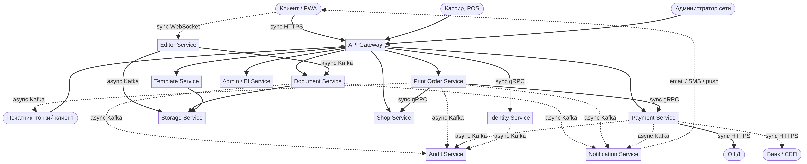
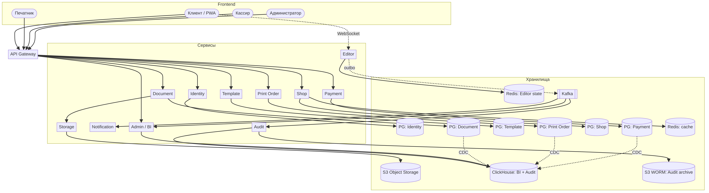
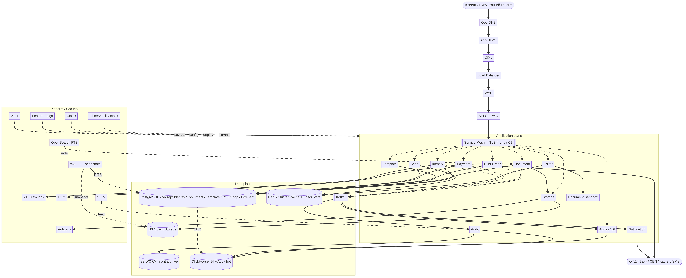

# HW2. HLD для «You Look Good In Print»

## Контекст

ФТ и НФТ из HW1: SaaS-офис + маркетплейс печати для сети копи-центров. РФ, 2026, сертификация ФСТЭК (УЗ-2). Целевой профиль: 100k DAU на старте, 1M через 3 года, до 30k заказов печати в сутки на старте, до 330k к третьему году.

---

## Part 1. Модули и интеграции

### Декомпозиция

Декомпозиция через DDD по бизнес-возможностям. Получился список из 11 сервисов:

1. **Identity Service**: регистрация, логин, 2FA, выдача JWT для всех акторов.
2. **Document Service**: CRUD документов, метаданные, история версий, права.
3. **Editor Service**: серверная часть редактора (DocServer-инстансы с in-memory моделью документа).
4. **Template Service**: каталог шаблонов, поиск, превью.
5. **Storage Service**: обёртка над S3-совместимым хранилищем для тел документов, версий, превью, спулов.
6. **Print Order Service**: оркестратор заказа печати (создание, статусы, маршрутизация в точку).
7. **Shop Service**: каталог копи-центров, принтеров, расписаний, доступности.
8. **Payment Service**: приём оплаты онлайн и офлайн, фискализация через ОФД, сверка.
9. **Notification Service**: email, SMS, push.
10. **Admin/BI Service**: кабинет администратора и аналитика.
11. **Audit Service**: приёмник событий аудита для ФСТЭК (WORM + SIEM).

Обоснование границ:

- Editor отделён от Document, потому что у них разный профиль. Editor stateful с in-memory моделью, sticky session, RAM-bound. Document stateless CRUD.
- Storage отделён от Document. Файл и метаданные имеют разный жизненный цикл и разный SLA (S3 ~ 99.95%, БД ~ 99.99%).
- Shop отделён от Print Order. Справочник точек меняется редко, заказы постоянно.
- Audit отдельным сервисом из-за нормативного требования неизменяемости (WORM-bucket).

### Способы взаимодействия

Общий принцип: блокирующий sync только там, где пользователь стоит и ждёт ответа. Всё остальное через Kafka с outbox-pattern.

| Откуда | Куда | Тип | Обоснование |
|---|---|---|---|
| Веб-клиент | API Gateway | sync HTTPS | Стандартный REST. |
| Веб-клиент | Editor | sync WebSocket | Правки в реальном времени. |
| API Gateway | Identity | sync gRPC | Валидация токена должна быть быстрой и блокирующей. |
| API Gateway | прочие сервисы | sync gRPC | Запрос пользователя ждёт ответа. |
| Editor | Document, Storage | async Kafka (outbox) | Snapshot и версия не критичны ко времени. |
| Print Order | Shop | sync gRPC | Нужно проверить слот до создания заказа. |
| Print Order | Payment | sync gRPC | Оплата блокирующая. |
| Print Order | точка (печатник) | async Kafka | Печатник тянет задачу из очереди. |
| Payment | ОФД | sync HTTPS | Фискализация требует синхронного ответа. |
| Любой сервис | Notification | async Kafka | Если notification лежит, заказ не страдает. |
| Любой сервис | Audit | async Kafka | Лог не должен блокировать бизнес-операцию. |
| OLTP-БД | BI | async CDC (Debezium) | Аналитика батчем. |

### C4 Container (без БД и инфры)

---

## Part 2. Базы данных

### Алгоритм выбора

По каждому сервису фиксируем access pattern (OLTP / OLAP / blob / queue / cache), требования по консистентности, объём, латенси. Дальше подбираем хранилище.

| Сервис | БД | Профиль и обоснование |
|---|---|---|
| Identity | PostgreSQL | OLTP, ACID, простая модель (users / roles), объём небольшой. |
| Document (metadata) | PostgreSQL | OLTP, JOIN документ-владелец-версия, частые SELECT и INSERT. |
| Editor (live state) | Redis | In-memory модель открытого документа, sticky по document_id, низкая латенси (10-50 мс). Потеря восстанавливается из последнего snapshot. |
| Template (metadata) | PostgreSQL | Маленький справочник, частое чтение. |
| Storage (тела файлов) | S3-совместимое (Yandex Object Storage) | Большие бинарники, by-design distributed, дешёвое хранение, версионирование объектов. |
| Print Order | PostgreSQL | ACID критичен (статусы, привязка к оплате), много UPDATE статусов. |
| Shop | PostgreSQL + Redis (кэш) | Справочник, редкие UPDATE, частые SELECT. Кэш Redis с TTL 5 минут. |
| Payment | PostgreSQL | ACID, изоляция serializable, идемпотентность по ключу, сверка с ОФД. |
| Notification | Kafka + Redis | Kafka как очередь доставки, Redis для дедупликации в окне 24 часа. |
| Admin / BI | ClickHouse | OLAP-агрегации (выручка, очереди, среднее время выполнения). CDC из Postgres через Debezium. |
| Audit | Kafka → ClickHouse + S3 (WORM-bucket) | Поток событий безопасности. Горячее хранение в ClickHouse 90 дней для поиска, холодное в WORM-S3 3 года для регуляторов. |

### Репликация

**PostgreSQL** (для каждого OLTP-сервиса):

- Streaming replication, 1 primary + 2 sync standby в разных AZ.
- WAL-G в S3 для PITR (point-in-time recovery).
- Для Payment изоляция serializable, синхронный commit (RPO 0).
- Для остального async commit, RPO 5 минут.
- Failover через Patroni + etcd (как в HW2-practice).

**ClickHouse**:

- ReplicatedMergeTree, replication factor 2, координация через ClickHouse Keeper.
- Distributed table сверху для запросов.

**Redis**:

- Redis Sentinel (3 узла) для Editor live state. Допускается потеря, так как восстанавливается из snapshot в S3.
- Redis Cluster для кэша справочников (с шардингом по ключу).

**S3**:

- Multi-AZ встроено в провайдер.
- Cross-region copy для холодных бэкапов и WORM-аудита.

**Kafka**:

- 3 брокера, replication factor 3, `min.insync.replicas=2`. Acks=all для outbox-сообщений.

### Шардинг

Шардируется только то, что превысит ёмкость одной ноды на горизонте 3 лет. Для остального достаточно primary + 2 replica.

| Хранилище | Ключ шардинга | Когда вводим | Технология |
|---|---|---|---|
| Document metadata | hash(user_id) | При >10M документов или >5k write/s | Citus или Tantor XL |
| Print Order | range(created_at) или hash(shop_id) | При >50M заказов | range по `created_at` для эффективного партиционного pruning по «свежим заказам», hash по `shop_id` если важна co-location с точкой |
| ClickHouse events | hash(date, user_id) | Сразу с первого дня | Distributed table |
| S3 | by-design distributed | Сразу | Object Storage |
| Redis Cluster (кэш) | hash slot | Сразу | Cluster mode |

Ключи шардинга прописываются в схему сразу на старте, даже если фактический шардинг включится только через 1-2 года. Это дешевле, чем мигрировать живую базу позже.

### HLD с БД

---

## Part 3. Дополнительные компоненты

### MUST

| Компонент | Обоснование | Реализация |
|---|---|---|
| API Gateway | Auth на edge, rate limit, преобразование протоколов, единая точка для WAF и observability | Tyk on-prem или Kong CE |
| Load Balancer | Распределение трафика между инстансами, healthcheck, TLS termination | Yandex Network LB + HAProxy внутри кластера |
| CDN | Раздача статики UI, превью документов и шаблонов, снижение нагрузки на Storage | Yandex Cloud CDN |
| WAF | OWASP Top 10, защита от ботов и краулеров | PT Application Firewall |
| Anti-DDoS | L3-L4 защита, обязательна по 187-ФЗ при категорировании КИИ | Servicepipe или StormWall |
| Cache | Горячие справочники (точки, тарифы), сессии, дедупликация в Notification | Redis Cluster |
| IdP | Централизованная аутентификация для клиентов и сотрудников, SSO, поддержка ГОСТ-TLS и токенов JaCarta / RuToken | Форк Keycloak |
| HSM | Хранение ключей шифрования и подписи, требование сертификации ФСБ | КриптоПро HSM, ViPNet HSM |
| SIEM | Корреляция событий безопасности из всех сервисов, обязательно для ФСТЭК-аттестации | MaxPatrol SIEM или Kaspersky Unified Monitoring |
| Observability | Метрики, логи, трейсы. SLO и error budget | OpenTelemetry Collector + Prometheus / VictoriaMetrics + Loki / OpenSearch + Tempo / Jaeger + Grafana |
| CI/CD | Автоматизация деплоя, security-scan в pipeline, canary | GitLab CE + ArgoCD + Harbor + Trivy |
| Backup | PITR PostgreSQL, snapshot S3. Требование 152-ФЗ | WAL-G + ежедневные S3-snapshots, retention 30 дней горячее + 1 год холодное |
| Антивирус | Проверка загружаемых пользователем DOCX / PPTX / PDF, требование ИБ | Kaspersky Scan Engine |
| Secrets manager | Хранение и ротация секретов приложений | HashiCorp Vault on-prem |

### SHOULD

| Компонент | Обоснование | Реализация |
|---|---|---|
| Service Mesh | mTLS, retry, circuit breaking при >5 сервисов в продакшене | Istio (или Linkerd для меньшего overhead) |
| Feature Flags | Безопасный rollout фич, A/B-тесты, kill-switch | Self-hosted Unleash |
| Geo DNS | Маршрутизация к ближайшему кластеру при выходе в город 2 и 3 | Yandex DNS |
| Full-text Search | Поиск по документам, шаблонам, заказам | OpenSearch (тот же, что под логи) |
| Document Sandbox | Изолированный рендеринг превью и конвертация DOCX / PPTX, чтобы зловредный документ не сломал DocServer | gVisor или Kata Containers под Editor / Template |
| PgBouncer | Пул соединений при росте числа backend-инстансов | Transaction pooling режим |

### COULD (отложено)

- Service catalog (Backstage) при >20 сервисах и нескольких командах.
- Chaos engineering (Chaos Mesh) после стабилизации MVP.
- Multi-region active-active при выходе на СНГ.

### Финальный HLD

---

## Резюме

11 сервисов, разделение по DDD-границам с явным критерием для каждой пары соседей. Sync gRPC только в путях пользовательского ожидания, остальное через Kafka outbox. Базовое хранилище PostgreSQL для OLTP, ClickHouse для аналитики и аудита, Redis для горячего кэша и live-состояния редактора, S3 для бинарей и WORM-архива аудита. Шардинг описан, но включается по триггерам объёма. В обвязке обязательны API Gateway, балансировка, WAF, anti-DDoS, наблюдаемость, HSM и SIEM (последние два из-за сертификации ФСТЭК). Service Mesh, FF, FTS, sandbox идут вторым шагом.
